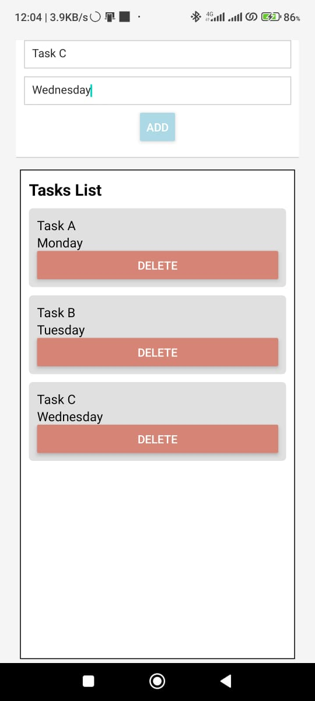
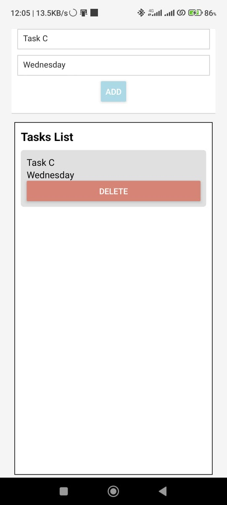

# ToDo List App

A simple React Native ToDo List app to help you manage your tasks and deadlines.

## Features

- Add tasks with due dates
- View and delete tasks
- Clean and intuitive user interface

## Screenshots




## Getting Started

### Prerequisites

- [Node.js](https://nodejs.org/) installed
- [Expo CLI](https://docs.expo.dev/workflow/expo-cli/) installed

### Installation

1. Clone the repository:

   ```bash
   git clone https://github.com/your-username/todo-list-app.git
   cd todo-list-app
   ```

2. Install dependencies:

   ```bash
   npm install
   ```

3. Start the Expo development server:

   ```bash
   npm start
   ```

4. Open the Expo Go app on your mobile device and scan the QR code from the terminal.

## Usage

1. Enter the task name and due date in the input fields.
2. Press the "ADD" button to add the task to the list.
3. View and manage your tasks in the scrolling task list.
4. To delete a task, press the "Delete" button next to the task.

## Contributing

Contributions are welcome! If you have ideas for improvements or find any issues, please open an issue or submit a pull request.

## Acknowledgments

- [React Native](https://reactnative.dev/)
- [Expo](https://docs.expo.dev/)
- Icons made by [Freepik](https://www.freepik.com) from [www.flaticon.com](https://www.flaticon.com/)
